# Momo App Backend

This is a simple backend for a Mobile Money (Momo) application. It handles user registration, login, and basic money transactions. The project is built using Python's built-in HTTP server and stores data in memory while the server is running.

## Team Task Sheet Link
https://docs.google.com/spreadsheets/d/1LWW4dxrE89CGnTajTj1NdM0wylfIUCB1LT4SD9t-K7I/edit?usp=sharing

## Features

- **User Authentication**: Secure signup and login using JWT tokens and password hashing.
- **Transaction Management**: Users can send money, view their history, and update or delete their transactions.
- **Seed Data**: The app automatically loads initial data from an XML file when it starts.
- **In-Memory Store**: No external database needed for testing; everything is kept in global variables during runtime.

## Project Structure

- `api/`: Contains the logic for different parts of the API (auth and transactions).
- `dsa/`: Includes logic to read and import data from XML files, defines how Users and Transactions are structured.
- `Docs/`: Includes the report document file of this project.
- `Screenshots/`: includes all the functionality success tests of the project.
- `database.py`: A central file that holds all data (users and transactions) in memory.
- `server.py`: The entry point that sets up the HTTP server and routes requests.
- `utils.py`: Helper functions for JSON responses, JWT handling, and password security.


## Getting Started

### Prerequisites

You should have Python 3 and `pipenv` installed on your machine.

### Installation

1. Navigate to the project folder.
2. Install the dependencies:
   ```bash
   pipenv install
   ```
3. Create a `.env` file in the root directory and add a secret key for authentication:
   ```env
   JWT_SECRET_KEY=secret_key_here
   ```

### Running the Server

Start the server by running:
```bash
python server.py
```
The server will start on `http://localhost:5000`.

## API Documentation

Most endpoints require a JWT token. Send it in the header as: `Authorization: Bearer <your_token>`.

### Authentication

#### Register a New User
- **URL**: `/auth/register`
- **Method**: `POST`
- **Body**:
  ```json
  {
    "name": "John Doe",
    "email": "john@example.com",
    "password": "securepassword",
    "balance": 1000.0
  }
  ```
- **Response (201 Created)**:
  ```json
  {
    "id": 1,
    "name": "John Doe",
    "email": "john@example.com",
    "balance": 1000.0,
    "role": "USER"
  }
  ```
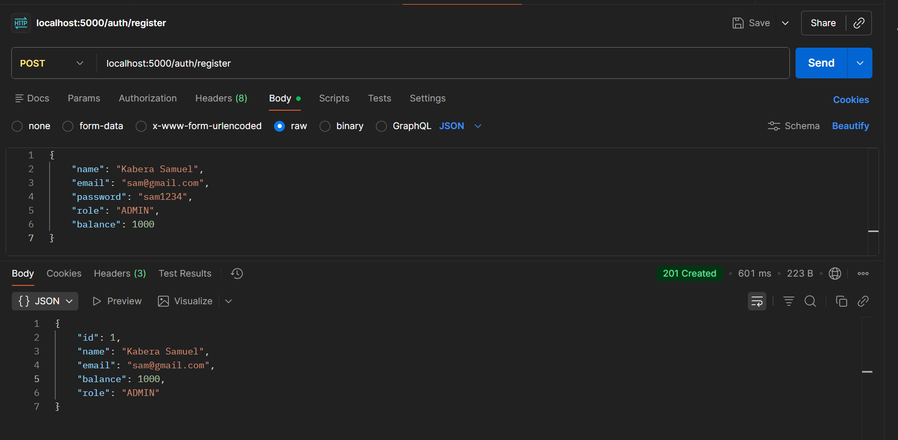

#### Login
- **URL**: `/auth/login`
- **Method**: `POST`
- **Body**:
  ```json
  {
    "email": "john@example.com",
    "password": "securepassword"
  }
  ```
- **Response (200 OK)**:
  ```json
  {
    "access_token": "eyJhbG..."
  }
  ```
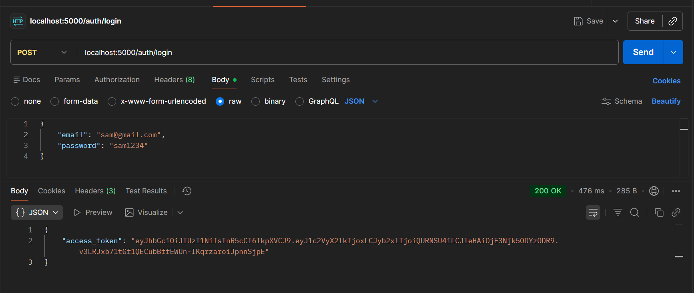

- **Response (401 Unauthorized)**:
  ```json
  {
    "message": "Invalid email or password"
  }
  ```
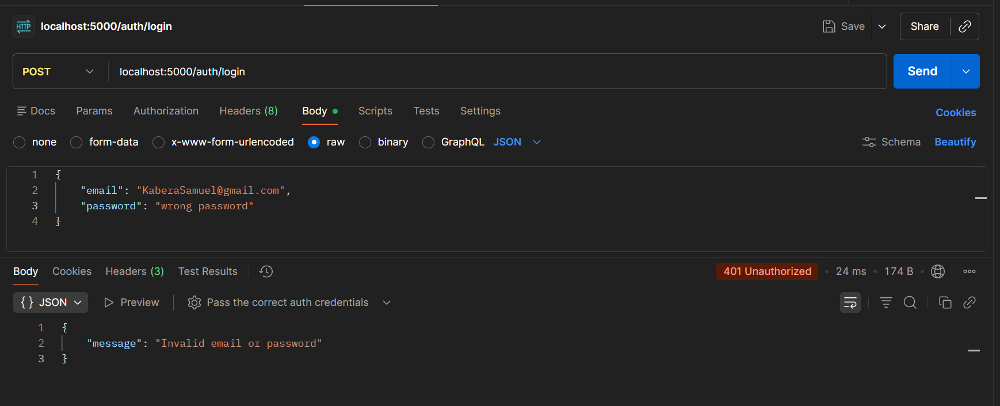

#### Logout
- **URL**: `/auth/logout`
- **Method**: `POST`
- **Auth Required**: Yes
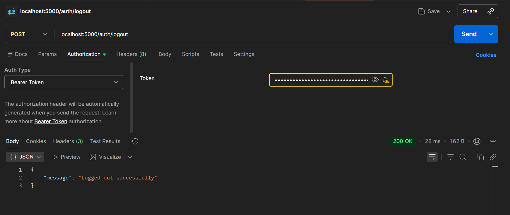

- **Accessing Protected Endpoint After Logout**:
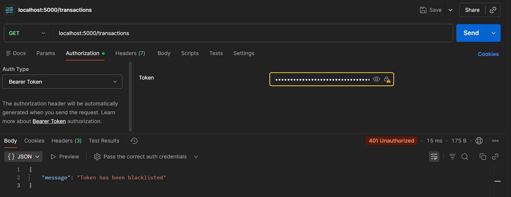

### Transactions

#### Create a Transaction
- **URL**: `/transactions`
- **Method**: `POST`
- **Auth Required**: Yes
- **Body**:
  ```json
  {
    "senderId": 1,
    "receiverId": 2,
    "amount": 50.0,
    "type": "transfer"
  }
  ```
- **Response (201 Created)**:
  ```json
  {
    "id": 1,
    "message": "Transaction successful"
  }
  ```
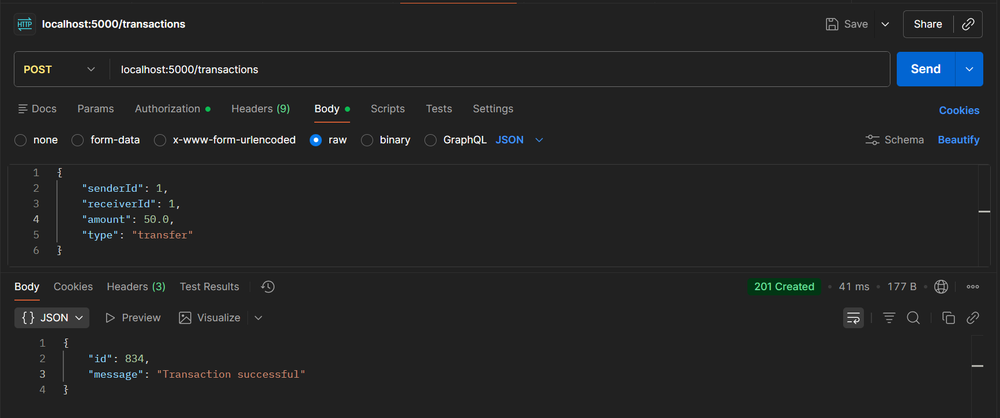

- **Response (400 Bad Request - Insufficient Balance)**:
  ```json
  {
    "message": "Insufficient balance"
  }
  ```
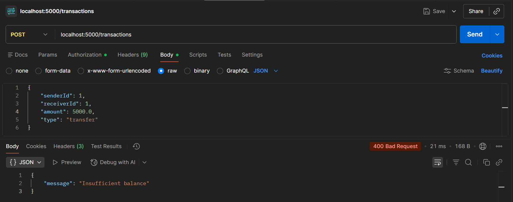

- **Response (400 Bad Request - Invalid Users)**:
  ```json
  {
    "message": "Invalid sender or receiver"
  }
  ```
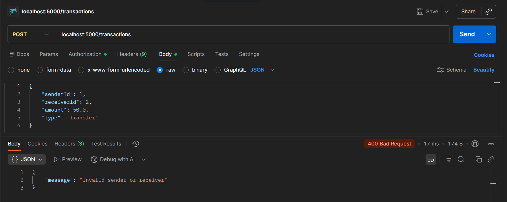

#### Get All Transactions
- **URL**: `/transactions/`
- **Method**: `GET`
- **Auth Required**: Yes
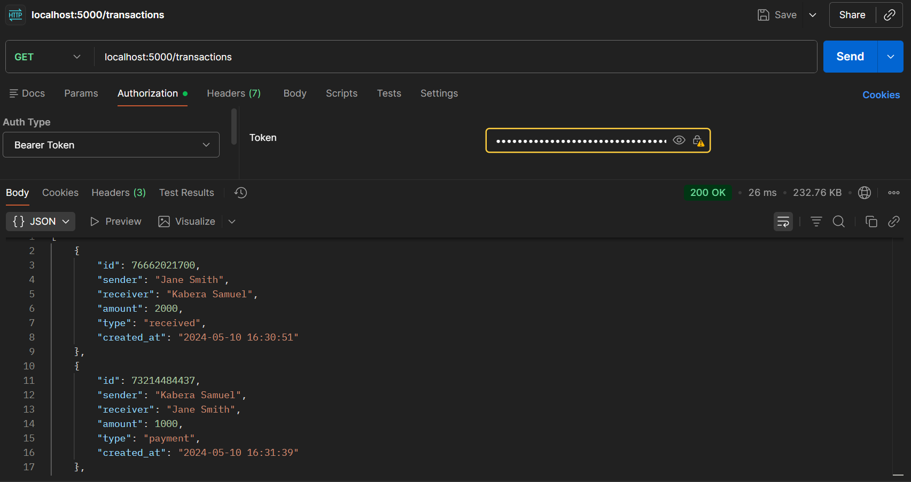

- **Response (401 Unauthorized - No Token)**:
  ```json
  {
    "message": "Authentication token is missing"
  }
  ```
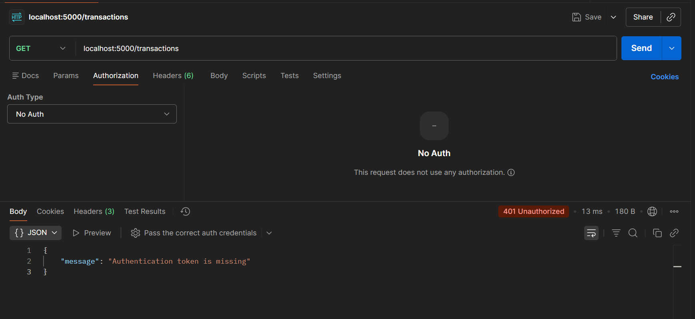

#### Get My Transactions
- **URL**: `/transactions/me`
- **Method**: `GET`
- **Auth Required**: Yes
- **Response**: A list of all transactions where you are either the sender or receiver.
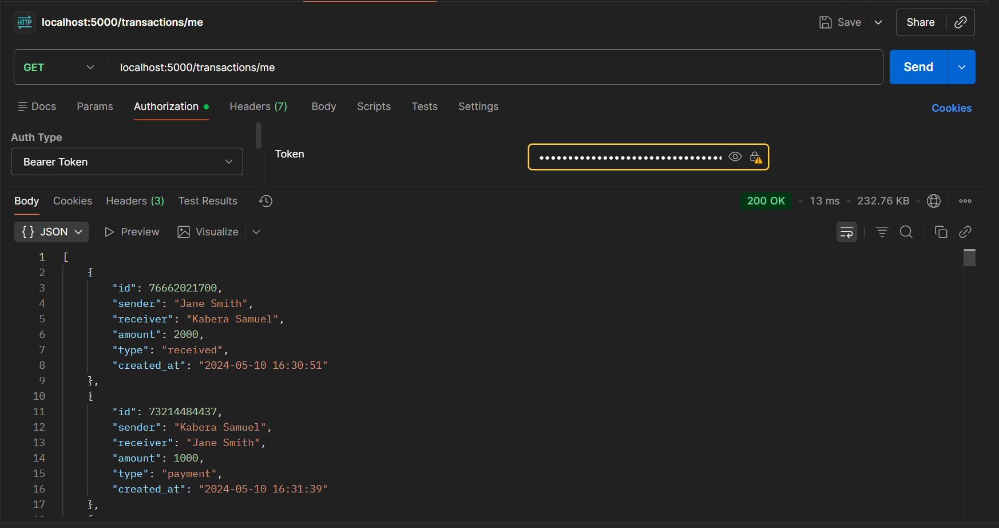

#### Get Transaction by ID
- **URL**: `/transactions/<id>`
- **Method**: `GET`
- **Auth Required**: Yes
- **Note**: Performs transaction lookup using by list index.
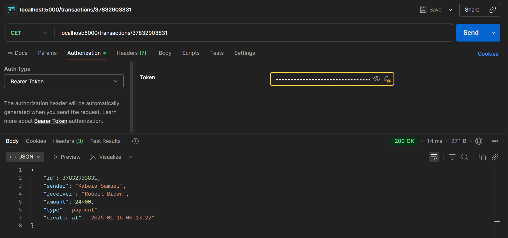

#### Get Transaction by ID (Indexed)
- **URL**: `/indexed_transactions/<id>`
- **Method**: `GET`
- **Auth Required**: Yes
- **Note**: Performs transaction lookup using by dictionary key.
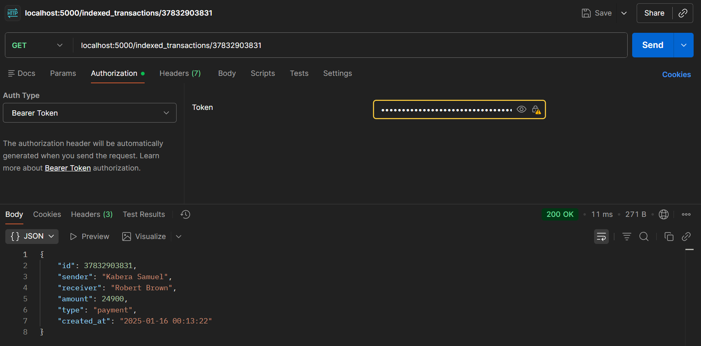

#### Update Transaction
- **URL**: `/transactions/<id>`
- **Method**: `PUT`
- **Auth Required**: Yes
- **Role Required**: `ADMIN`
- **Body**: 
  ```json
  {
    "type": "payment"
  }
  ```
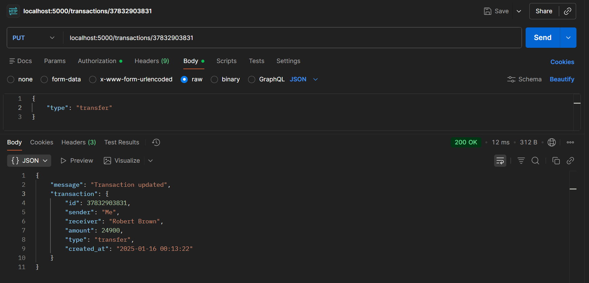

- **Update Failed (Not Admin)**:
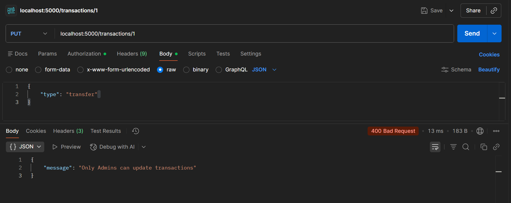
- **Note**: Only the transaction type can be updated, and this operation is restricted to Admin users.

#### Delete Transaction
- **URL**: `/transactions/<id>`
- **Method**: `DELETE`
- **Auth Required**: Yes
- **Role Required**: `ADMIN`
- **Note**: This operation is restricted to only Admin users.
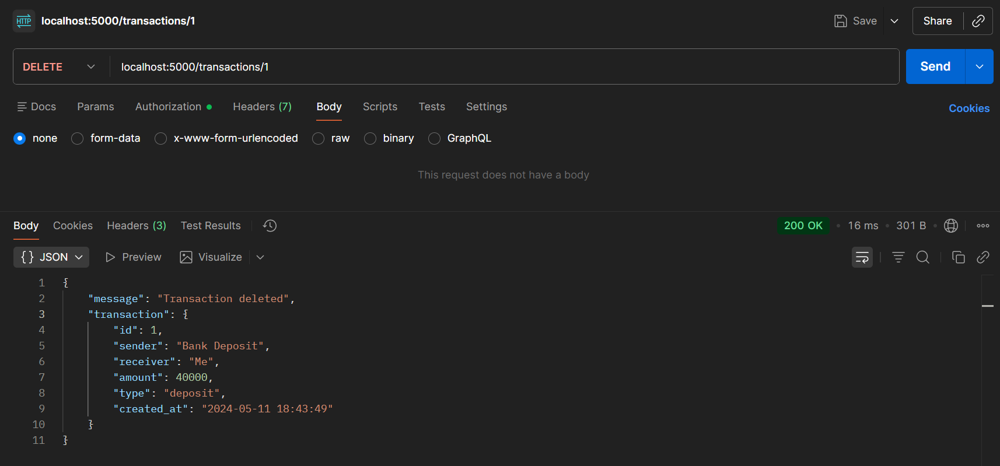

- **Delete Failed (Not Admin)**:
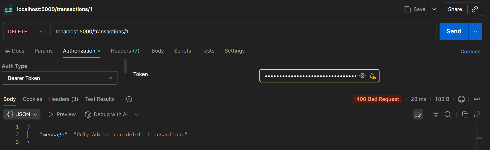


## Unit Testing
pipenv run pytest

